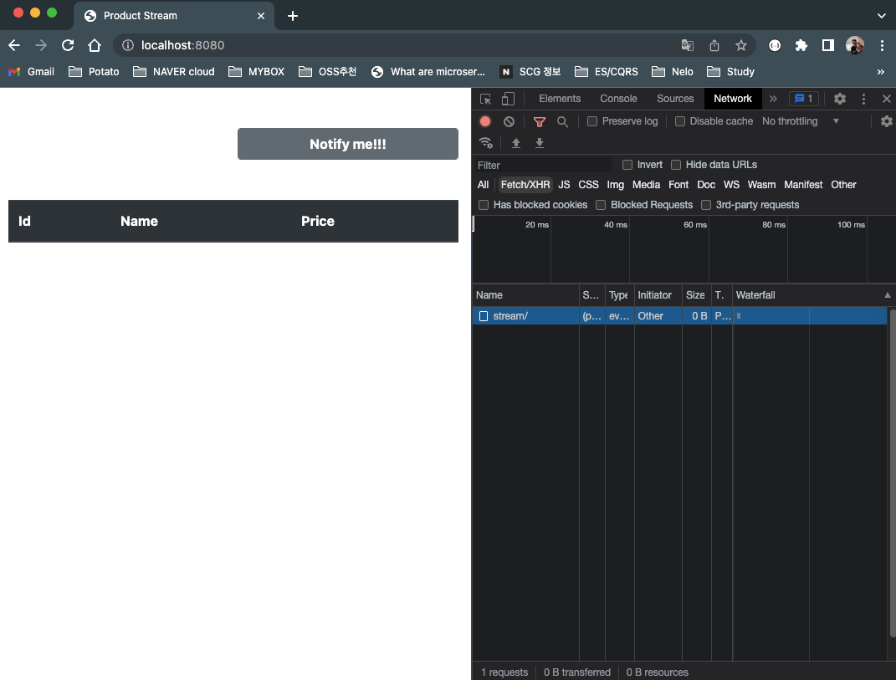
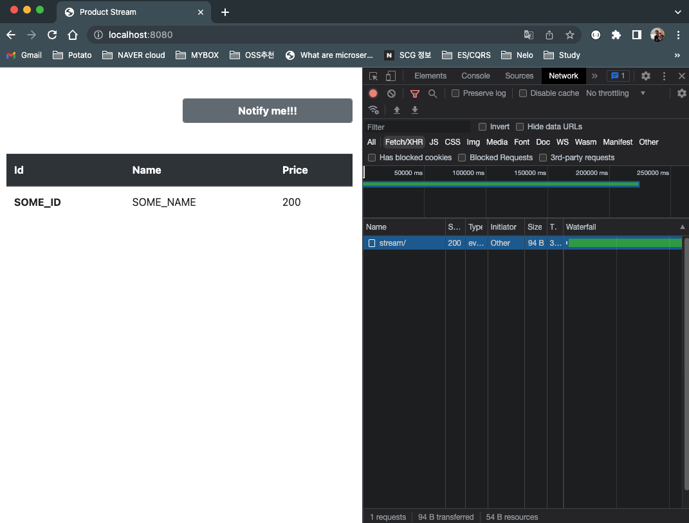

# Server Send Event 예제

## 사전준비
- Spring Webflux
```groovy
implementation 'org.springframework.boot:spring-boot-starter-webflux'
```

## SinkConfig
- input : sink를 이용해 데이터를 입력하고, 
- output : flux 이용해 SampleDto를 반환
```java
@Configuration
public class SinkConfig {

    // input
    @Bean
    public Sinks.Many<SampleDto> sink(){
        return Sinks.many().replay().limit(1);
    }

    // output
    @Bean
    public Flux<SampleDto> sampleDtoFlux(Sinks.Many<SampleDto> sink){
        return sink.asFlux();
    }
}
```

## SampleController
- Browser에서 /sse/stream으로 접속하면, 대기하게된다.
- RestClient를 통해서 /sse/create로 데이터를 전송하면, /sse/stream으로 데이터가 전송된다.
- /sse/stream 의 설정을 보면 produces = MediaType.TEXT_EVENT_STREAM_VALUE 를 확인할 수 있다.
```java
@RequiredArgsConstructor
@RestController
@RequestMapping("sse")
public class SampleController {
    private final Flux<SampleDto>       flux;
    private final Sinks.Many<SampleDto> sink;

    @GetMapping(value = "/stream", produces = MediaType.TEXT_EVENT_STREAM_VALUE)
    public Flux<SampleDto> getSSE(){
        return flux;
    }

    @PostMapping(value = "/create")
    @ResponseStatus(value = HttpStatus.CREATED)
    public Mono<Void> create(@RequestBody SampleDto sampleDto){
        sink.tryEmitNext(sampleDto);
        return Mono.empty();
    }
}
```

## Test
- Test를 위해서 localhost:8080으로 접속한다.
- "Notify me" 를 눌러 대기한다.


- RestClient를 통해서 데이터를 전송한다.
```http request
POST http://localhost:8080/sse/create
Content-Type: application/json

{
"id" : "SOME_ID",
"name" : "SOME_NAME",
"price" : 200
}
```

- 대기하고 있던 Browser에서 데이터가 전송된다.
